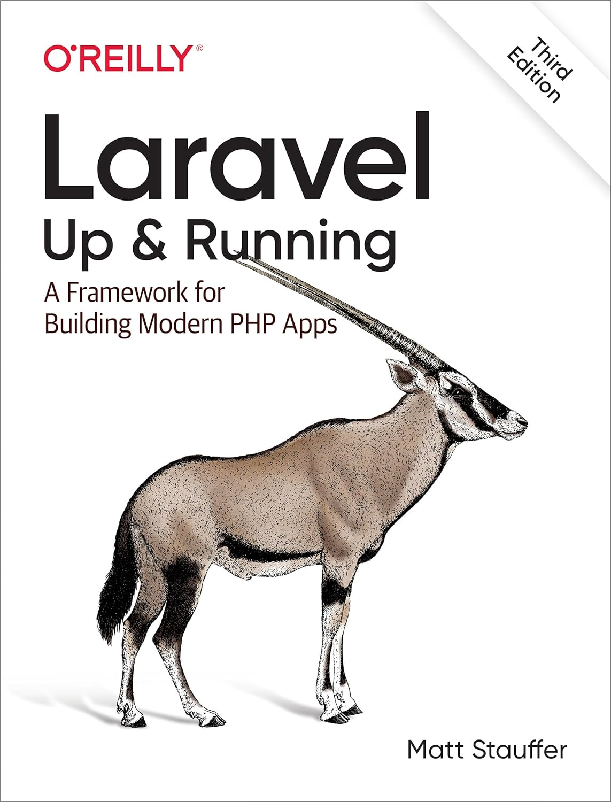

# Yup, we make software.

At [Tighten](https://tighten.com) we are dedicated to building the best products while contributing to the well-being of as many people as we can.

## Products

- [Jigsaw](https://jigsaw.tighten.com) - Jigsaw is a framework for rapidly building static sites using the
same modern tooling that powers your web applications.
- [Ziggy](https://github.com/tighten/ziggy) - Ziggy provides a JavaScript `route()` function that works like Laravel's, making it a breeze to use your named Laravel routes in JavaScript.
- [Takeout](https://github.com/tighten/takeout) - Takeout is a CLI tool for spinning up tiny Docker containers, one for each of your development environment dependencies.
- [Duster](https://github.com/tighten/duster) - Automatic configuration for Laravel apps to apply Tighten's standard linting & code standards.
- [Tlint](https://github.com/tighten/tlint) - Tighten linter for Laravel conventions.
- [Ozzie](https://github.com/tighten/ozzie) - Ozzie is Tighten's open source projects monitor. Each project is assigned a "debt score" based on how many open issues/PRs there are, and how old they are.

## Resources

- [Onramp to Laravel](https://onramp.dev) - Providing an easy entrance into Laravel for new developers.
- [Laravel Versions](https://laravelversions.com) - Release dates and timelines for security and bug fixes for all versions of Laravel.
- [PHP Releases](https://phpreleases.com) - Provides API endpoints for support information for PHP versions 5.6 and later.
- [Laravel Tricks](https://laravel-tricks.com/tricks) - Laravel Tricks was created to help the Laravel community find and share interesting ways of using Laravel framework.

## More from Tighten Crew

### Podcasts

- [The Laravel Podcast](https://laravelpodcast.com) - Join [Matt Stauffer](https://github.com/mattstauffer) and season 6 co-host [Taylor Otwell](https://github.com/taylorotwell) as they discuss the exciting developments around the Laravel ecosystem.
- [Twenty Percent Time Podcast](https://twentypercent.fm) - Twenty Percent Time is a podcast for programmers, designers, business owners, & more from the good folks at Tighten.

### We Wrote The Book

Matt Stauffer, our co-founder, wrote the canonical book on the Laravel framework, now in its **third** edition.

## Reach Out

We'd love to hear from you!

We can be reached at [hello\@tighten.com](mailto:hello@tighten.co).

Or connect with us on [Twitter (X)](https://twitter.com/TightenCo) or [LinkedIn](https://www.linkedin.com/company/tightenco).
